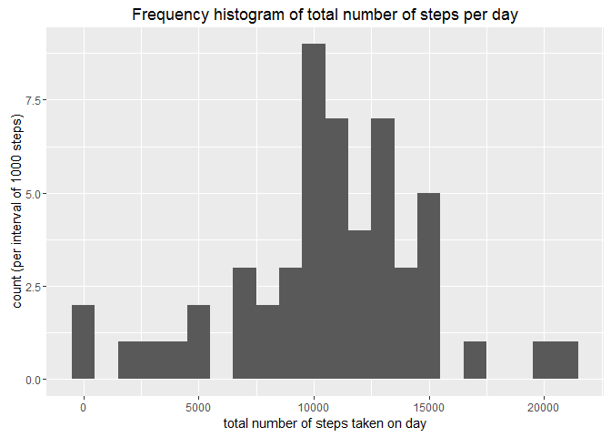
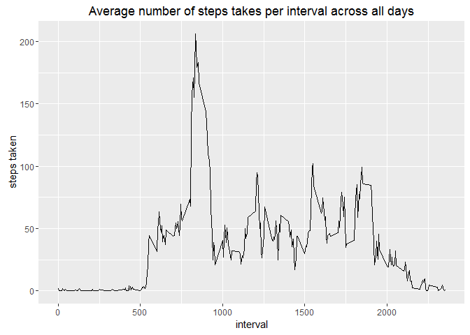
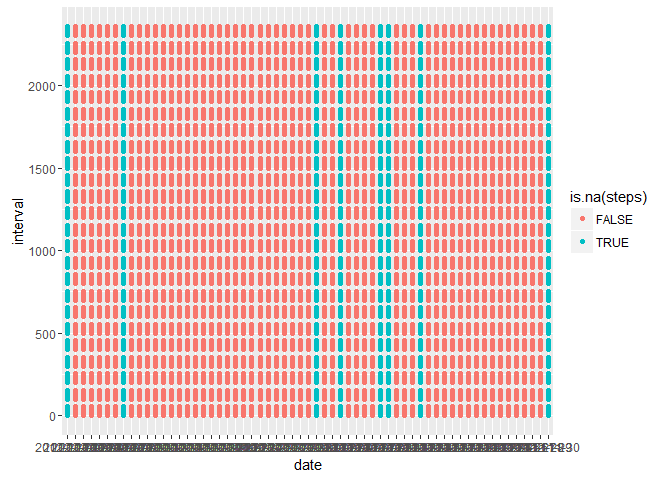
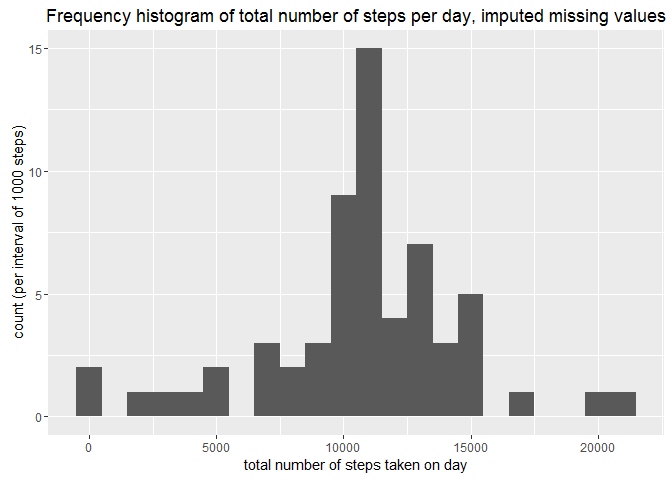
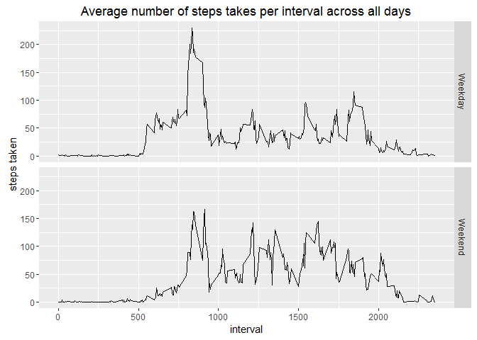

# Reproducible Research: Peer Assessment 1


## Loading and preprocessing the data
load the nescessary libraries, then unzip and read the Activity file:

```r
library(ggplot2)
library(dplyr)
unzip("activity.zip")
activity<-read.csv("activity.csv")
```


## What is mean total number of steps taken per day?

1. Make a histogram of the total number of steps taken each day

```r
activityByDay <- group_by(activity,date)
totalStepsByDay<-summarise(activityByDay,totalsteps=sum(steps))
qplot(totalsteps,data=totalStepsByDay,binwidth=1000,main="Frequency histogram of total number of steps per day",
      xlab = "total number of steps taken on day", ylab = "count (per interval of 1000 steps)")
```

```
## Warning: Removed 8 rows containing non-finite values (stat_bin).
```

<!-- -->


2. Calculate and report the mean and median of the total number of steps taken per day

```r
meansteps<-mean(totalStepsByDay$totalsteps,na.rm=TRUE)
mediansteps<-median(totalStepsByDay$totalsteps,na.rm=TRUE)
```

The mean total number of steps taken each day is 1.0766189\times 10^{4}.  
The median total number of steps taken each day is 10765.


## What is the average daily activity pattern?

1. Make a time-series plot of the 5 minute-interval (x-axis) and the average number of steps taken (y-axis) averaged across all days


```r
activityByInterval <- group_by(activity,interval)
averageStepsByInterval<-summarise(activityByInterval,averagesteps=mean(steps,na.rm=TRUE))
qplot(interval,averagesteps,data=averageStepsByInterval,geom="path",main="Average number of steps takes per interval across all days",
      ylab = "steps taken")
```

<!-- -->

2. Which 5-minute interval (averaged across all days) has the largest number of steps?

```r
maxInterval=averageStepsByInterval$interval[which.max(averageStepsByInterval$averagesteps)]
```

The interval with the largest umber of steps across all day is 835.  


## Imputing missing values

1. Calculate the total number of missing values


```r
numberMissing=sum(is.na(activity$steps))
```

The total number of missing values is 2304.


2. Devise a strategy for imputing missing values

Let's analyse where the missing values occur and whether there's a pattern to be discovered

```r
NA_activity<-activity[is.na(activity$steps),]
qplot(date,interval,data=activity,color=is.na(steps))
```

<!-- -->

It appears that only complete days are missing. That means we could replace the values for those days by the average values over all days for the same interval

3. Created an imputed version of the dataset


```r
activityImputed<-merge(activity,averageStepsByInterval,all.x=TRUE,by.all=interval)
activityImputed$steps[is.na(activityImputed$steps)]<-activityImputed$averagesteps[is.na(activityImputed$steps)]
activityImputed$averagesteps<-NULL
```

4. Make a histogram and calculate the mean and median for the imputed dataset

```r
activityImputedByDay <- group_by(activityImputed,date)
totalImputedStepsByDay<-summarise(activityImputedByDay,totalsteps=sum(steps))
qplot(totalsteps,data=totalImputedStepsByDay,binwidth=1000,main="Frequency histogram of total number of steps per day, imputed missing values",
      xlab = "total number of steps taken on day", ylab = "count (per interval of 1000 steps)")
```

<!-- -->

```r
meanImputedsteps<-mean(totalImputedStepsByDay$totalsteps,na.rm=TRUE)
medianImputedsteps<-median(totalImputedStepsByDay$totalsteps,na.rm=TRUE)
```

The mean total number of steps taken each day with imputed missing data is 1.0766189\times 10^{4}.  
The median total number of steps taken each day with imputed missing data is 1.0766189\times 10^{4}.

**It appears the there is no difference at all between the mean total number of steps before and after imputing the missing data, but the median  is very slightly affected. This is because an imputed value is now the median value.**


## Are there differences in activity patterns between weekdays and weekends?

1. Create a new factor variable weekday / weekend (we need to choose a common time locale for this; it is reset to your local time local directly afterwards)

```r
Sys.setlocale(category = "LC_TIME", locale = "Dutch_Netherlands.1252")
```

```
## [1] "Dutch_Netherlands.1252"
```

```r
activityImputed$weekday<-weekdays(strptime(activityImputed$date,format="%Y-%m-%d"))
activityImputed$dayType[activityImputed$weekday %in% c("maandag","dinsdag","woensdag","donderdag","vrijdag")]<-"Weekday"
activityImputed$dayType[activityImputed$weekday %in% c("zaterdag","zondag")]<-"Weekend"
activityImputed$dayType<-factor(activityImputed$dayType)
activityImputed$weekday<-NULL
Sys.setlocale(category = "LC_TIME", locale = "")
```

```
## [1] "Dutch_Netherlands.1252"
```

2. Make a panel plot comparing activity patterns between weekdays and weekends

```r
activityImputedByInterval <- group_by(activityImputed,interval,dayType)
averageStepsByInterval<-summarise(activityImputedByInterval,averagesteps=mean(steps,na.rm=TRUE))
qplot(interval,averagesteps,data=averageStepsByInterval,geom="path",main="Average number of steps takes per interval across all days",
        ylab = "steps taken",facets = dayType ~ . )
```

<!-- -->

